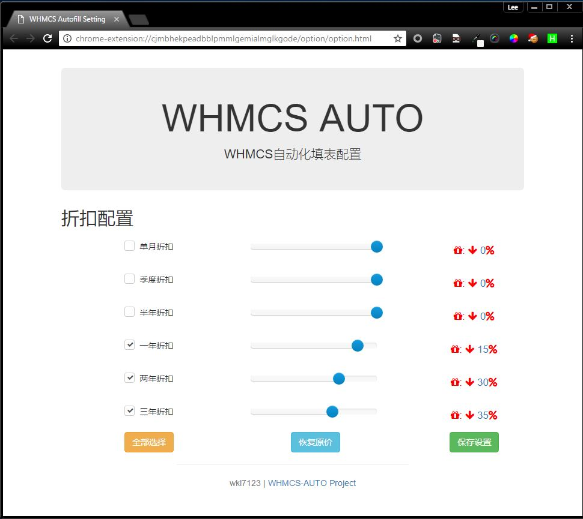
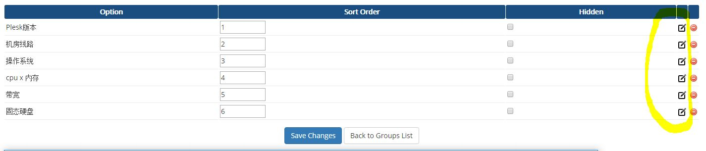
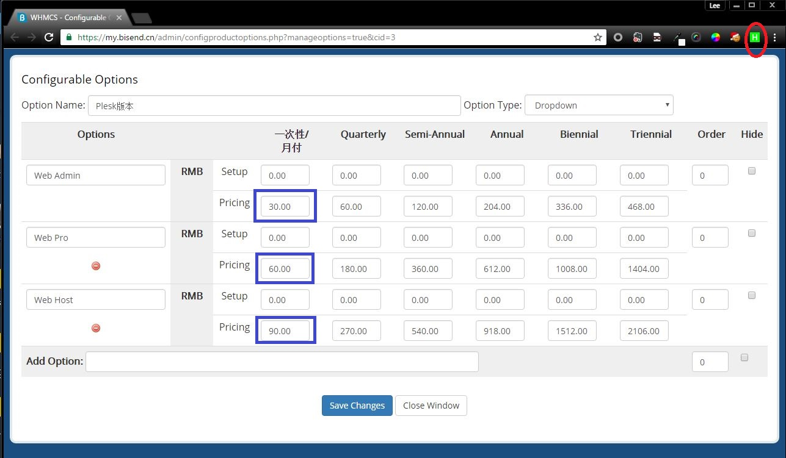

# WHMCS-AUTO

安装该插件后先去option页面(插件图标右键选择Options)配置折扣, 保存后退出。

然后去whmcs管理员的可配置选项页(`domain/admin/configproductoptions.php`),
随便编辑一个选项，可以看到图标的变化。

点击新的编辑按钮，页面会在新的页面打开，而不是一个弹出窗口。

对里面的每个`Option`的`Pricing`右边第一个空格填入单月价格后再点插件图标，就会把整行的价格都自动填上(`单月价格x月份数x折扣`)

